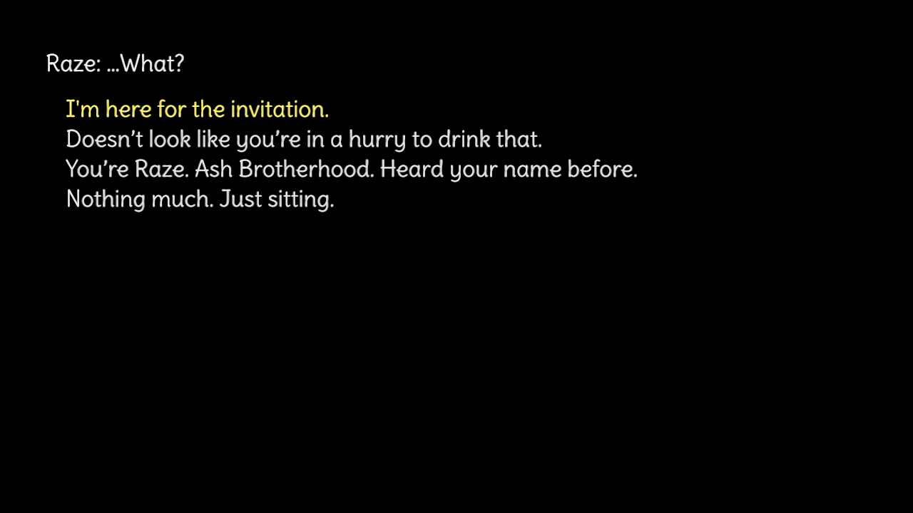

# The Mute Lift

This is an assignment project for CMU 15466/15666 course.

#### Author: Jialan Dong

#### Design:

It's a small plot-heavy game. Players read, choose, and see what's going on with the story. The story is a piece from a bigger narrative I created.

#### Text Drawing: 

Text is rendered at runtime. FreeType get the .ttf font files. HarfBuzz read the texts, get the FreeType Face, and shapes characters into glyphs.  FreeType then rasterize glyphs on first use to R8 bitmaps that will be cached.  OpenGL take the bitmaps as quad textures and draw them based on the coordinates HarfBuzz provides. `TextHB.hpp/TextHB.cpp` is the font pipeline.

#### Choices:

This game use `\dist\dialogues.txt` to store all the choices and narratives. All texts are organized in a special format, then `Dialogue.hpp/Dialogue.cpp` read the txt and store them into dialogue states. The game it self don't need to update. Once you make a choice, the text state machine move forward and draw new texts.

#### Screen Shot:

#### How To Play:

[If you encountered compile error due to C4819, try run `set CL=/utf-8` to set to UTF-8]

Use keyboard Up and Down to switch between choices.

Use keyboard Enter/Return to confirm the choice.

#### Sources: 

GPT is used to help understand the codebases and create the pipeline.

The font is from [Google Font](https://fonts.google.com/specimen/Delius?lang=en_Latn&categoryFilters=Feeling:%2FExpressive%2FCute).

This game was built with [NEST](NEST.md).

